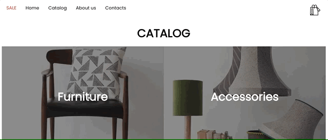
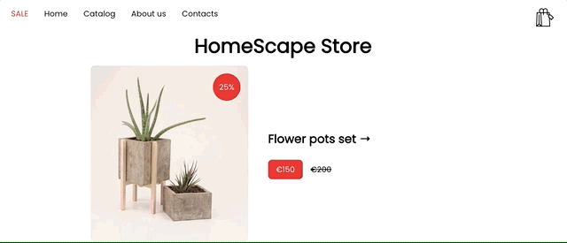
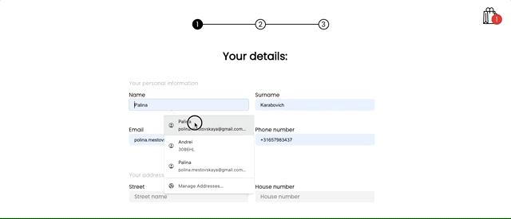
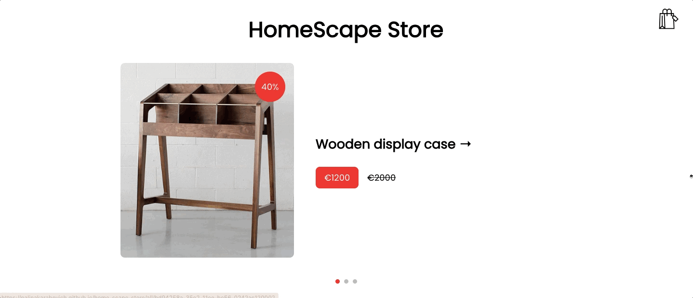
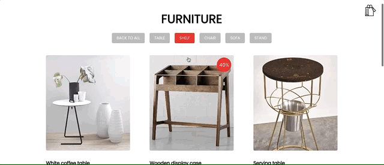

# HomeScapeStore

Furniture and accessories store with categories, cart and checkout. You can filter items and apply promo codes. On the main page you can find custom slider with products on sale. Product's card have bread-crumbs and ability to open the photo as a modal window. Design is responsive.

Visit the app on [GITHUB-PAGES](https://palinakarabovich.github.io/home-scape-store/).

## Features
- The app offers categories for easy navigation.       
  
- Users can add items to their shopping cart and apply promo codes.         
  
- Checkout form has validation.          
  
- The main page features a custom slider that showcases products currently on sale, catching the user's attention.        
  
- Users can interact with product cards. The product card page includes breadcrumbs, helping users to navigate.       
  
- The app is designed to be responsive, ensuring an optimal user experience across various devices and screen sizes.        
  

## Technologies
- React
- Redux ToolKit
- Typescript
- React-hook-form
- Leaflet.js

## Getting Started

1. Clone the repository.
2. Install dependencies with `npm install`.
3. Run the app with `npm start`.
4. Navigate to [localhost](http://localhost:3000/home-scape-store/) in your browser to view the app.
